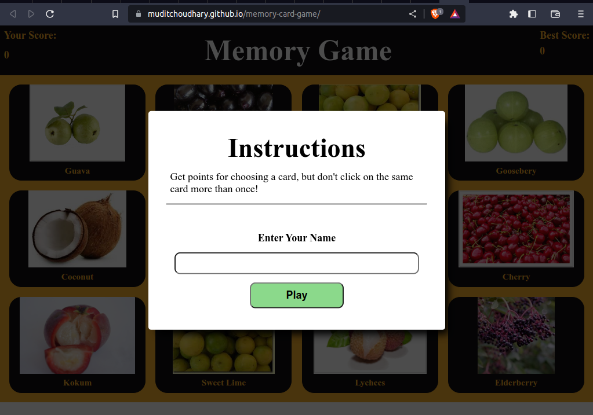

# Memory Card Game

This is a project in theodinproject. The purpose of this project is to practice the fundamental concepts of React framework, Functional Components, Hooks, etc.

# Demo

# What did I learn?

-   How to use functional components.
-   Difference between functional and class-based components.
-   what are hooks and effects?
-   How to use the useState hook.
-   How to pass props to child components.
-   How to update states in an array of objects and nested objects.
-   How the rendering and re-rendering process of react works behind the scene.

# What Improvements could be made?

-   Some UI animations could be added.
-   Some sound effects could be added.
-   The readability of the code could be improved more.

# Fun fact about this project

I chose the fruits for the cards because I had trouble memorizing the names of the fruits when I was a child. I always either forgot or mismatched names with other fruits. That's why I chose fruits so I can memorize them now. Lol

# Getting Started with Create React App

This project was bootstrapped with [Create React App](https://github.com/facebook/create-react-app).

## Available Scripts

In the project directory, you can run:

### `npm start`

Runs the app in the development mode.\
Open [http://localhost:3000](http://localhost:3000) to view it in your browser.

The page will reload when you make changes.\
You may also see any lint errors in the console.
